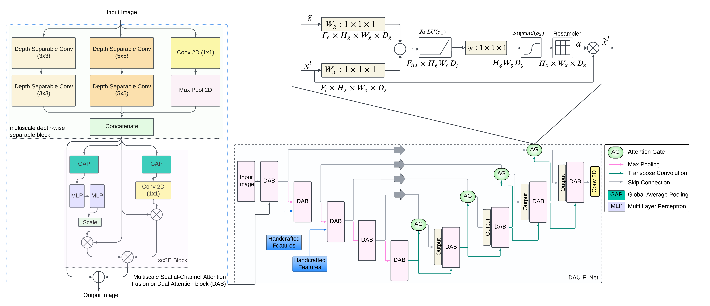

# Dual-Attention-U-Net-with-Feature-Infusion-Pushing-the-Boundaries-of-Multiclass-Defect-Segmentation
The DAU-FI Net for semantic segmentation, excelling in challenging scenarios like multiclass imbalanced datasets with limited samples. Through innovative features like multiscale spatial-channel attention and precise feature injection, it enhances object localization accuracy. The core employs a multiscale depth-separable convolution block, complemented by a spatial-channel squeeze and excitation (scSE) unit. Additive attention gates connect encoder-decoder pathways, further refining segmentation results.

The Proposed Dual Attentive U-Net with Feature Infusion (DAU-FI Net) Architecture 
